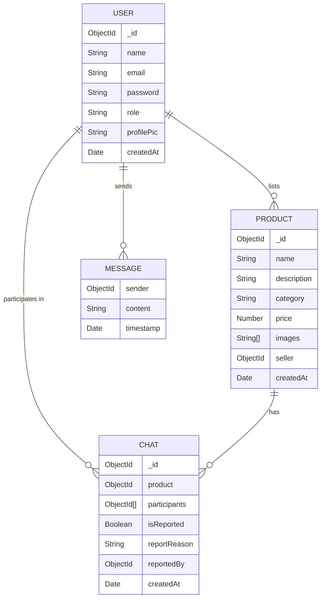

# System Design & Architecture

## ER Diagram (Entity-Relationship)

## System Architecture

The system follows a 3-tier architecture:
1. **Client Layer (Frontend)**: React + Vite application handling UI and user interactions.
2. **Server Layer (Backend)**: Node.js + Express API handling business logic, authentication, and socket connections.
3. **Data Layer (Database)**: MongoDB storing users, products, and chat history.

Additional **AI Service** runs independently to provide recommendations and moderation support.
